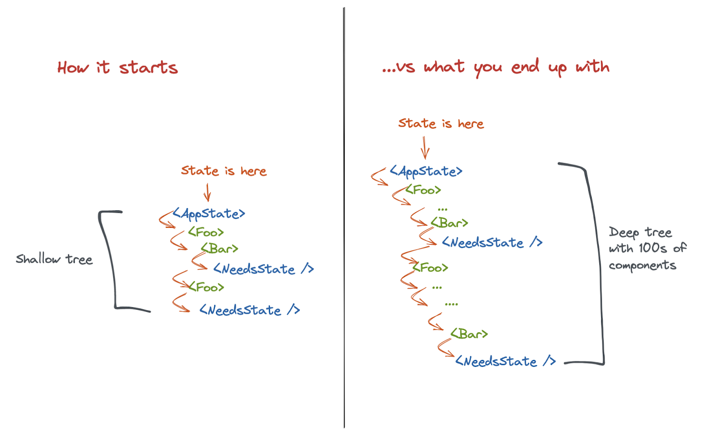

---
# You can also start simply with 'default'
theme: default
# random image from a curated Unsplash collection by Anthony
# like them? see https://unsplash.com/collections/94734566/slidev
background: https://cover.sli.dev
# some information about your slides (markdown enabled)
title: Welcome to Slidev
info: |
  ## Slidev Starter Template
  Presentation slides for developers.

  Learn more at [Sli.dev](https://sli.dev)
# apply unocss classes to the current slide
class: text-center
# https://sli.dev/custom/highlighters.html
highlighter: shiki
# https://sli.dev/guide/drawing
drawings:
  persist: false
# slide transition: https://sli.dev/guide/animations#slide-transitions
transition: slide-left
# enable MDC Syntax: https://sli.dev/guide/syntax#mdc-syntax
mdc: true
---

# Improving react statemanagement (preact-signals)

---

# About me

- preact-signals enthusiast
- I like performant applications
- professional Javascript hater
- professional React hater
- worked in different JS codebases

---

# Talk structure

- Discuss problems with React statemanagement
  - Hard to write any logic
  - Performance problems
- What is possible solution? Maybe, Reactive systems? (Solid.js)
- Adopting reactivity in React (preact-signals)
- Rewriting app with preact-signals
- preact signals drawbacks
- QA

---
layout: two-cols-header
layoutClass: gap-x-3
---

## Is React statemanagement any good? Or `useFootGun`

::left::

### Logic on useEffect

```ts{*|6|13|*}
useEffect(() => {
  if (!connected) {
    return;
  }
  console.log(subscriptions);
  setPaymentsState({
    ...paymentsState,
    subscriptions: subscriptions
  });
}, [connected, subscriptions]);

useEffect(() => {
  if (!connected) {
    return;
  }
  setPaymentsState({
    ...paymentsState,
    products: products
  });
}, [connected, products]);
```

::right::

### Unstable references {v-click}

```ts{hide|*}{at:'+0'}
const musicPlayer = useMusicPlayer();
const { togglePlayback } = musicPlayer;
useEffect(() => {
  togglePlayback({
    playbackId: "intro",
    playbackSource: require("./../../../assets/audio/intro.mp3"),
  });
  return () => {
    togglePlayback(undefined);
  };
}, [togglePlayback]);
```

<!--
If anyone tried to express complex logic, using react primitives - he knew that it really hard. React team made a lot of traps for us.
It relies on current value in clojure
-->

---

## React performance

```jsx{*|17-26|22|1-6|24|7-15|*}
const Counter = ({ count, onIncrement }) => (
  <div>
    Count: {count}
    <button onClick={onIncrement}>Increment</button>
  </div>
);
const HugeComponentTree = () => {
  let res = 0;
  const target = 10_000_000 + Math.random() * 10_000_000;
  for (let i = 0; i < target; i++) {
    res += Math.random();
  }
  return res;
};

function App() {
  const [counter, increment] = React.useReducer((count) => count + 1, 0);
  return (
    <>
      <Counter count={counter} onIncrement={increment} />

      <HugeComponentTree  />
    </>
  );
}
```

<!--
React is inefficient by default.
-->

---

## How do production app render tree look like?

{class='mx-auto max-h-[420px]'}

---
class: "relative"
---

## Solid.js - with JSX, but fast

[Test it out](https://playground.solidjs.com/anonymous/0eca54da-e148-424f-bdd0-640bcfce8223){class='absolute right-18 bottom-5 z-10'}

````md magic-move
```tsx
const Counter = ({ count, onIncrement }) => (
  <div>
    Count: {count}
    <button onClick={onIncrement}>Increment</button>
  </div>
);
const HugeComponentTree = () => {
  let res = 0;
  const target = 10_000_000 + Math.random() * 10_000_000;
  for (let i = 0; i < target; i++) res += Math.random();
  return res;
};

function App() {
  const [counter, increment] = React.useReducer((count) => count + 1, 0);
  return (
    <>
      <Counter count={counter} onIncrement={increment} />
      <HugeComponentTree />
    </>
  );
}
```

```tsx
const Counter = (props) => (
  <div>
    Count: {props.count}
    <button onClick={() => props.onIncrement()}>Increment</button>
  </div>
);
const HugeComponentTree = () => {
  let res = 0;
  const target = 10_000_000 + Math.random() * 10_000_000;
  for (let i = 0; i < target; i++) res += Math.random();
  return res;
};

function App() {
  const [counter, setCounter] = createSignal(0);
  const increment = () => setCounter((it) => it + 1);
  return (
    <>
      <Counter count={counter()} onIncrement={increment} />

      <HugeComponentTree />
    </>
  );
}
```
````

<!--
Solid js uses reactivity
-->

---

## Should we rewrite our projects with Solid.js?

### Of course not{v-click class='h-full flex flex-col gap-4 items-center justify-center'}

<!--
You must have a good reason for new rewrite, but you can start new projects 
with solid.js. 
Actually technologies do not matter much
-->

---
class: "w-full h-full flex items-center justify-center text-center"
---

## Technologies do not matter much

<!--
You can build poor product with great technologies and create great ones with Javascript on backend.
[TODO]: add some examples on slide
But we can fix our pains by adopting best patterns to React
-->

---

## Can we adopt the same patterns in React?

````md magic-move
```tsx{none|*}
const Counter = ({ count, onIncrement }) => (
  <div>
    Count: {count}
    <button onClick={onIncrement}>Increment</button>
  </div>
);
const HugeComponentTree = () => {
  let res = 0;
  const target = 10_000_000 + Math.random() * 10_000_000;
  for (let i = 0; i < target; i++) res += Math.random();
  return res;
};

function App() {
  const [counter, increment] = React.useReducer((count) => count + 1, 0);
  return (
    <>
      <Counter count={counter} onIncrement={increment} />
      <HugeComponentTree />
    </>
  );
}
```

```tsx
const Counter = ({ count, onIncrement }) => (
  <div>
    Count: {count}
    <button onClick={onIncrement}>Increment</button>
  </div>
);
const HugeComponentTree = () => {
  let res = 0;
  const target = 10_000_000 + Math.random() * 10_000_000;
  for (let i = 0; i < target; i++) res += Math.random();
  return res;
};

function App() {
  const [counter, increment] = [useSignal(0), () => counter.value++];
  return (
    <>
      <Counter count={counter} onIncrement={increment} />
      <HugeComponentTree />
    </>
  );
}
```
````

---
layout: iframe
url: https://stackblitz.com/edit/vitejs-vite-zuyyux?embed=1&file=src%2FApp.jsx
---

<!--
Now we just updating components that really needs to be updated
-->

---

# Preact signals API

<v-switch>

<template #1>

```ts twoslash
import { signal } from "@preact/signals-core";

const counter = signal(10);
```

</template>

<template #2>

```ts twoslash
import { signal } from "@preact/signals-core";

const counter = signal(10);

type Simplify<T extends Record<any, any>> = {
  [TKey in keyof T]: T[TKey];
};
type Sig = Simplify<typeof counter>;
```

</template>

<template #3>

```ts twoslash
import { signal, computed } from "@preact/signals-core";

const counter = signal(10);
const doubled = computed(() => counter.value * 2);
```

</template>

<template #4>

```ts {monaco-run} {height: 'auto'}
import { signal, computed, effect } from "@preact/signals-core";

const counter = signal(10);
const doubled = computed(() => counter.value * 2);

effect(() => {
  console.log(doubled.value);
});
```

</template>

</v-switch>

<!--
Let's explore api of signals

Check signal type.
Check computed signal type

Writing part:
- show how effects reacts on signal change
- how to dispose effect
- show example with conditional execution of effect (add logCounter signal)
- show effect dispose function
- show infinite loop caused by effect
-->

---
layout: quote
class: text-center
---

# Let's explore how to use preact signals in practice

---
